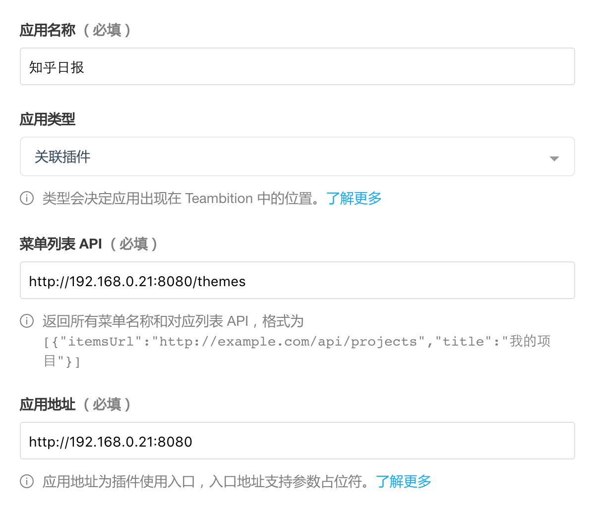
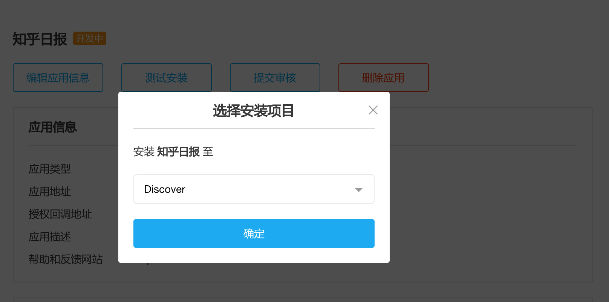
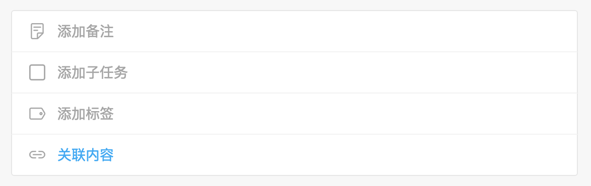
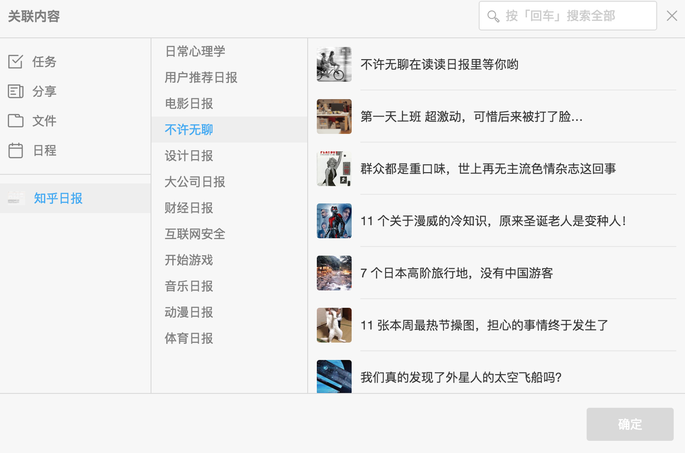
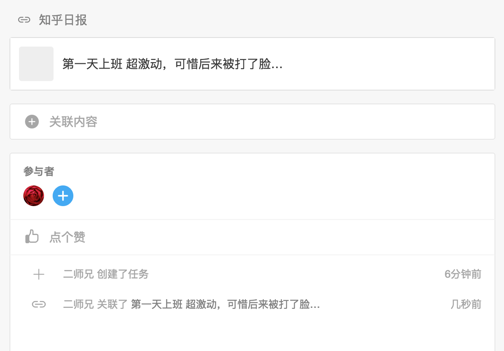

# 关联插件开发手册

关联插件提供了统一的接口和内容结构，以便开发者可自行开发关联内容插件，用户可更方便的添加内容到 Teambition 中。

## 第一步，注册应用

访问应用中心创建自己的应用，选择类型为关联应用，并填写菜单 api 地址。（当前的例子中为 `http://192.168.0.82:8080/themes`）



菜单 api 地址是用户访问关联插件的入口，由开发者自己的服务器托管，必须按如下格式返回数据

```
[{
  "title": "菜单1",  // 列表标题
  "itemsUrl": "url1"     // 内容 API
}, {
	"title": "菜单2",
	"itemsUrl": "url2"
}]
```

## 第二步，开发应用

用户需要为关联插件开发两组 api，一个是上面提到的菜单 api，另一个是上面返回结果中的 itemsUrl，用户点击对应的菜单项后将请求 itemsUrl 抓取能关联的内容列表。itemsUrl 必须按如下格式返回数据

```
[{
  "title": "xxx 发布了一条微博",   // 内容标题
  "content": "微博内容",         // 正文
  "thumbnailUrl": "picurl",     // 可选缩略图
  "redirectUrl": "redirecturl",  // 点击后跳转链接
  "created": "2016-09-12"       // 创建时间
}, {
  "title": "xxx 又发布了一条微博",
  "content": "微博内容",  
  "thumbnailUrl": "picurl",
  "redirectUrl": "redirecturl",
  "created": "2016-09-12"      
}]
```

如果列表内容较多需要分页，关联插件会主动添加 `count` 和 `page` 参数，供开发者实现分页功能。

发送到关联应用的请求中会带上 `X-Teambition-Sign` 请求头参数，开发者可根据创建应用时获得的 clientId 和 clientSecret 自行验证请求是否合法，同时可从签名中取得 Teambition 用户 id。具体校验规则参考 [auth.js](./lib/auth.js)。

## 第三步，安装应用

点击应用中心的「测试安装」按钮，将应用安装到自己的项目中



## 第四步，调试应用

回到项目中，点开任意任务的「关联内容」按钮，可以在左侧看到新安装的应用





选择一条关联内容，点击「完成」，一条新的关联内容就生成了



## 第五步，提交审核

回到应用中心，提交审核应用。Teambition 管理员会在审核结束后开放应用的安装权限给所有用户。

## 恭喜你，完成了一个关联应用

示例是一个知乎日报的关联应用，你可以基于这个例子开发自己的应用，或者选择任意语言或框架开发关联应用。
